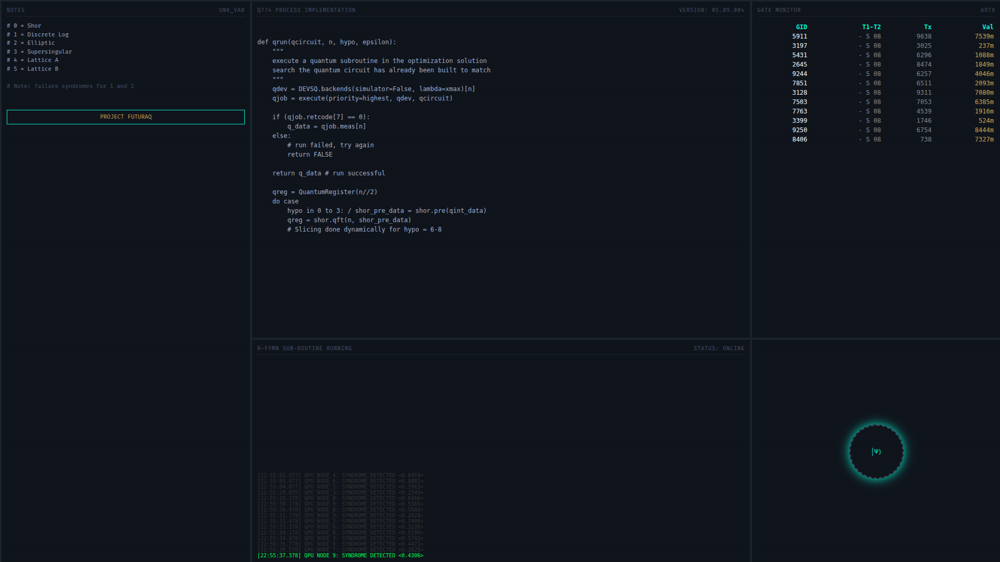

# holo-ui: Holographic Quantum Dashboard




**holo-ui** is the visual interface for the Quantum-AI Hybrid Platform. It creates a high-fidelity, cinematic environment for quantum engineers to visualize circuit execution, analyze variance syndromes, and monitor system status in real-time.

> *Inspired by the aesthetic of "Devs", prioritizing data density and atmospheric immersion.*

## 👁 Mission
To transform the abstract mathematics of quantum mechanics into a tangible, operational command center.

## 🏗 Stack
*   **Frontend:** React 18, TypeScript, Custom CSS (CRT/Scanline Effects).
*   **Backend:** FastAPI (Python), WebSockets (Real-time telemetry).
*   **Visualization:** Grid-based layout engine with real-time DOM manipulation.

## 📂 Directory Structure
```text
holo-ui/
├── backend/        # FastAPI REST & WebSocket server
│   └── app/        # Routes, Models, Controllers
├── frontend/       # React SPA
│   └── src/        # Components, Hooks, Context
└── docs/
    └── images/     # UI Screenshots and Assets
```

## 🛠 Roadmap
- [x] **v0.1:** Cinematic Dashboard Skeleton (MVP)
- [ ] **v0.5:** Live connection to `qai-engine` (Python Code Streaming)
- [ ] **v1.0:** 3D Bloch Sphere visualization & Job Monitoring

## ⚡ Dev Setup
```bash
# Backend
cd backend && pip install -r requirements.txt && uvicorn app.main:app --reload

# Frontend
cd frontend && npm install && npm run dev
```

---
*Part of the FuturaQ QAHP Ecosystem.*
